# ChainAlert - Real-Time Blockchain Alert App (SwiftUI)

A native iOS front end for a real-time blockchain event alert product. Track any wallet,
token, or contract, set your own threshold rules, and get sub-2-second push alerts when
something moves on-chain. Built in **SwiftUI (iOS 17+)** to match a provided Figma/Stitch
design system, with realistic mockup data so every screen is demoable on a simulator with no
backend, wallet, or hardware dependency.

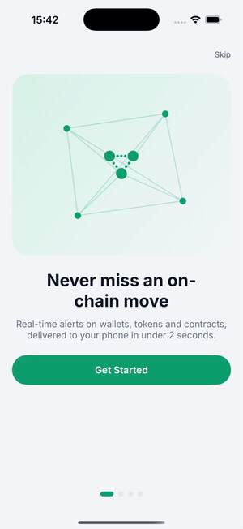

## Screens

| | | |
|---|---|---|
| 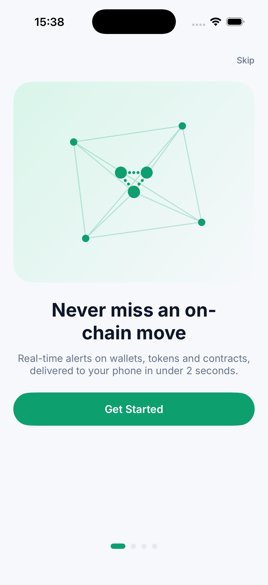 | 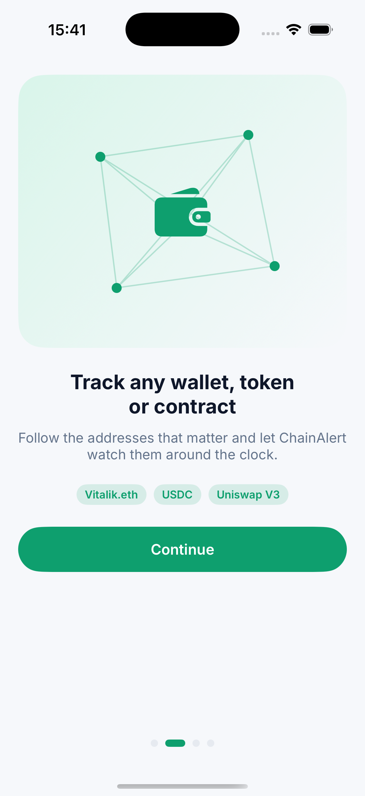 | 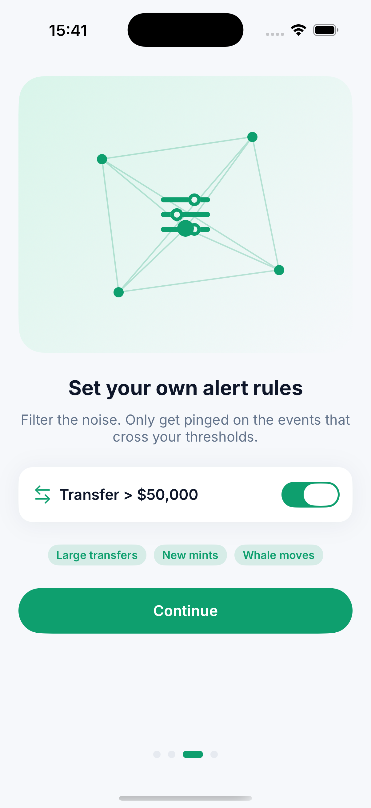 |
| Onboarding - welcome | Onboarding - track | Onboarding - rules |
| 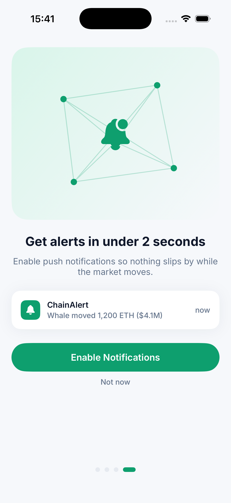 | 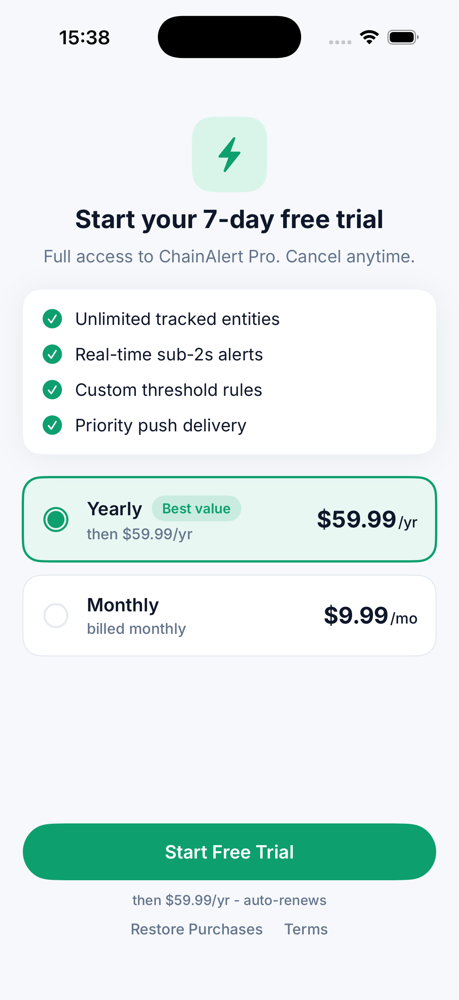 | 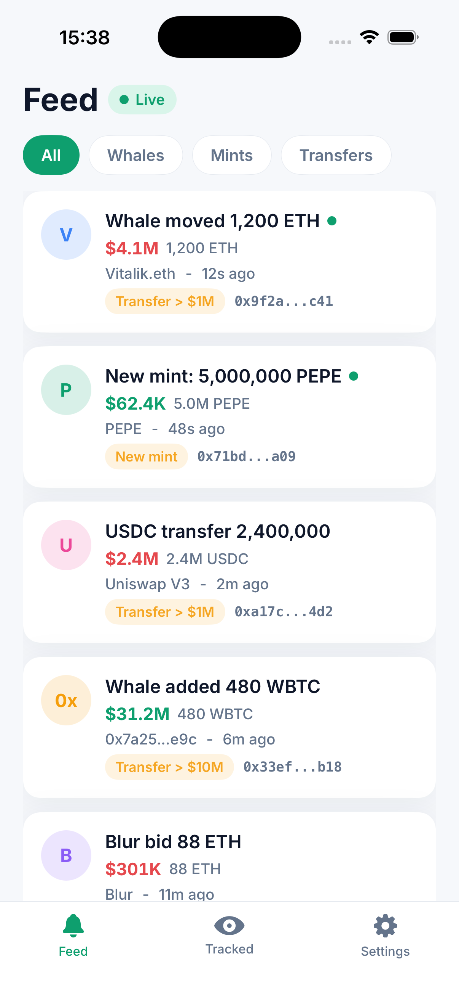 |
| Onboarding - notifications | RevenueCat paywall | Live alert feed |
| 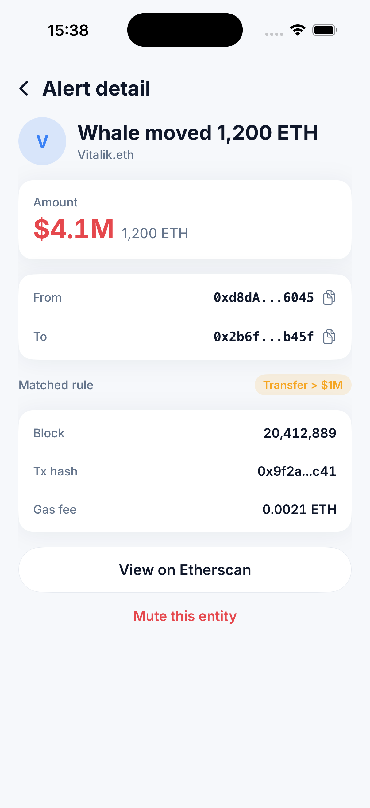 | 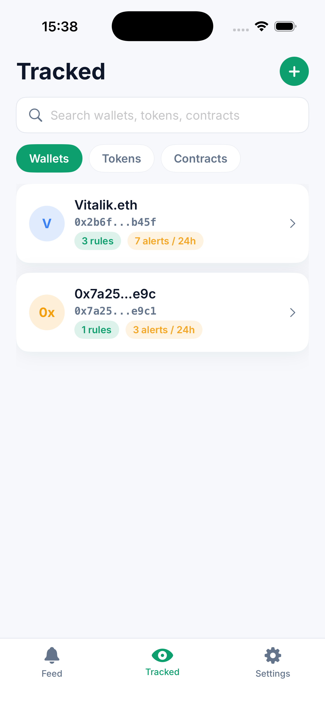 | 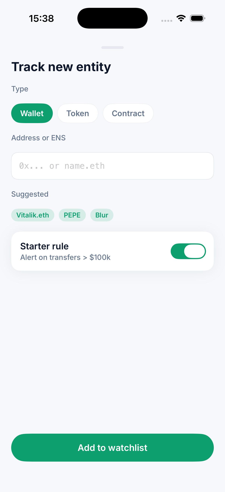 |
| Alert detail | Tracked entities | Add entity |
| 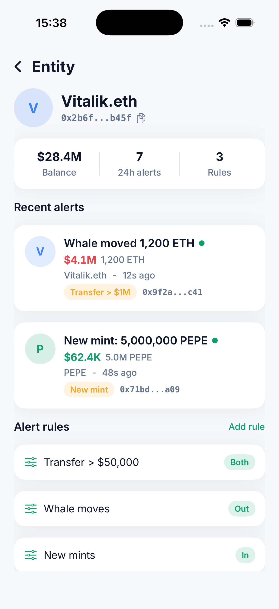 | 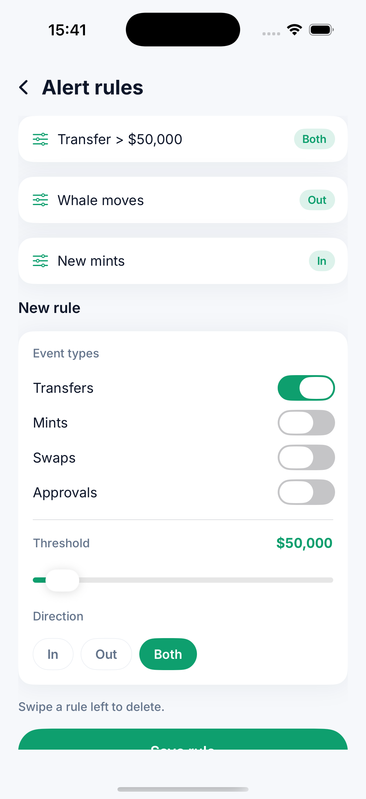 | 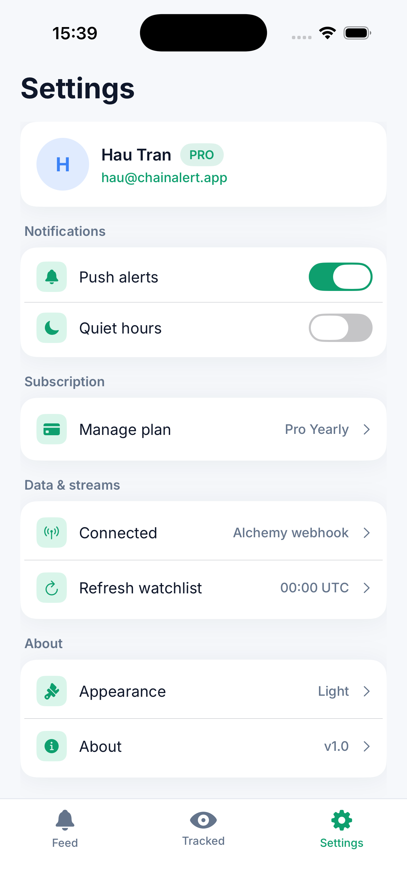 |
| Entity detail | Alert rules | Settings |
| 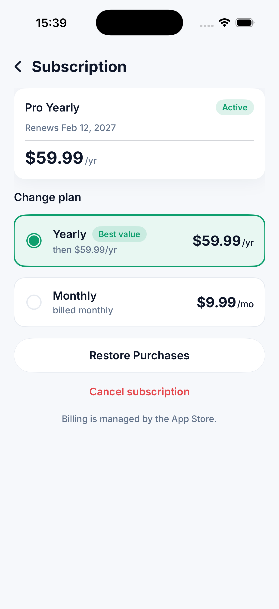 | | |
| Manage subscription | | |

## What it shows

- **4-step interactive onboarding** (welcome -> track -> rules -> enable notifications) that
  flows into a **RevenueCat-style paywall** with a 7-day free trial and yearly/monthly plans.
- **Live feed** of on-chain alerts with a "Live" stream chip, a filter segmented control
  (All / Whales / Mints / Transfers), inflow/outflow coloured amounts, matched-rule tags, and
  unread dots. Tapping a card opens a full **alert detail** (from/to, matched rule, block, tx
  hash, gas fee, "View on Etherscan").
- **Tracked entities** watchlist across Wallets / Tokens / Contracts, with an **add-entity**
  modal (type selector, ENS/address input, suggested chips, starter rule) and an **entity
  detail** with balance/alerts/rules stats.
- **Alert rules** builder: event-type toggles (Transfers / Mints / Swaps / Approvals), a USD
  threshold slider, and an In / Out / Both direction selector.
- **Settings** with account + PRO badge, push and quiet-hours toggles, subscription
  management, and a "Connected: Alchemy webhook" data-streams section reflecting the backend
  design (webhook listener + 00:00 UTC watchlist cron).
- The mandatory **3-tab bar** (Feed / Tracked / Settings) is shown only on the three primary
  screens; onboarding, paywall, modals, and detail screens hide it, exactly per the design.

## App flow

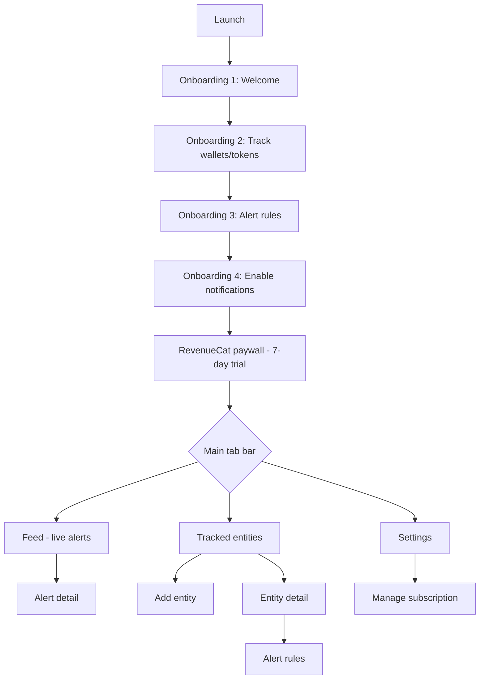

## Architecture

- **SwiftUI, iOS 17+**, `@Observable` app state (`AppState`) holding seeded mockup data
  (alerts, tracked entities, plans). No networking - all data is deterministic so screens are
  stable for demos and screenshots.
- **Design system in code** (`Theme/Theme.swift`): the exact Stitch tokens - near-white
  `#F6F8FB` canvas, single emerald `#0E9F6E` accent, `#D9F5EA` tint, slate text - plus the
  **Inter** type scale loaded from bundled font files (`Resources/Fonts`).
- **Reusable components** (`Components/`): the 3-tab bar, alert card, entity row, plan card,
  live chip, pill segmented control, tag chips, avatars, primary/secondary buttons.
- **One file per screen group** under `Screens/`, driven by a small phase router
  (onboarding -> paywall -> main tabs) in `ChainAlertApp.swift`.
- The `design/` folder holds the source-of-truth Stitch export (`DESIGN.md`, `brief.json`,
  per-screen `index.html`) the UI was built to match.

Maps to the job's stack: SwiftUI app + Node.js/TypeScript webhook engine on Railway,
Firebase (Firestore + FCM) for delivery, RevenueCat for subscriptions, Alchemy EVM webhooks
for data. This repo is the iOS client, wired against mock data.

## Run

```sh
brew install xcodegen          # if needed
xcodegen generate
open ChainAlert.xcodeproj
# select an iPhone 17 Pro simulator and Run
```

Requires Xcode 17+ / iOS 17 SDK. No signing needed for the simulator.
